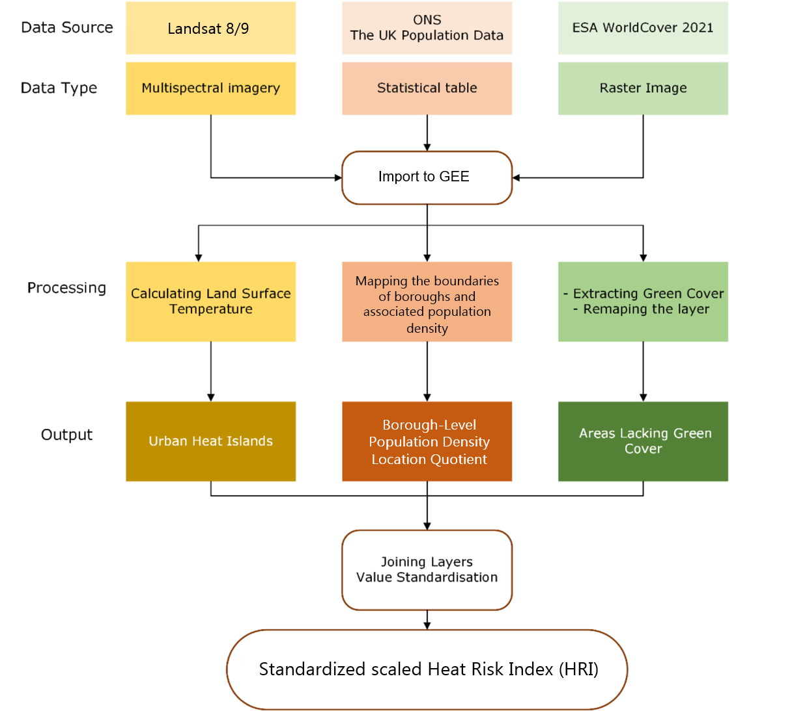
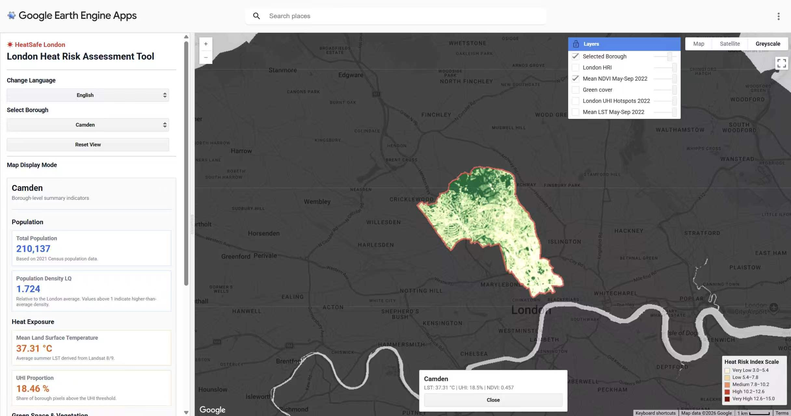
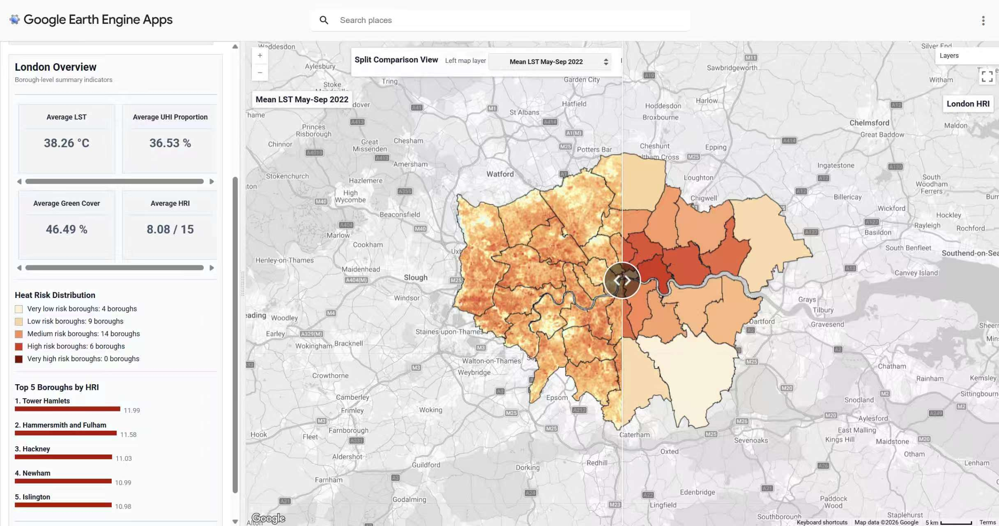

## Project Summary

This project develops an interactive spatial Heat Risk Index (HRI) platform for London, aiming to bridge the gap between academic heat-risk research and practical urban governance. By integrating Land Surface Temperature (LST), vegetation indicators, Urban Heat Island (UHI) proportion, and population density LQ, the platform transforms complex spatial datasets into a clear borough-level heat risk assessment. Using precomputed Google Earth Engine layers, the dashboard supports efficient visualisation, localised borough profiling, and split-screen comparison between key indicators. The platform provides actionable insights for urban planners, public health agencies, and climate adaptation teams to identify high-risk areas and prioritise targeted heat mitigation interventions.

------------------------------------------------------------------------

### Problem Statement

London faces increasing extreme heat and urban heat island risks, threatening public health and economic resilience. In 2020, heat-related economic losses reached £577 million, while the 2022 heatwaves caused around 370 deaths(Climate Resilience Center, 2023; Simpson, Brousse and Heaviside, 2024). This project develops a borough-level Heat Risk Index (HRI) to systematically assess and visualise London’s heat risk. The platform helps planners, policymakers and stakeholders identify priority areas for intervention and supports climate adaptation, green infrastructure and urban resilience goals in the London Plan 2021.

### End User

This Heat Risk Index (HRI) is designed for users across urban governance, public health, and spatial analysis in London, including planners, local authorities, public health agencies, and GIS analysts. These users require tools that are both scientifically robust and accessible to support decision-making under increasing heat risks.

While extensive research on urban heat exists, there remains a gap between academic outputs and practical implementation. This project addresses this by integrating land surface temperature, green cover, NDVI, and population density into a single, spatially explicit index, providing a clear and interpretable representation of heat risk across boroughs.

## Data

<table>
  <tr>
    <th>CATEGORY</th>
    <th>DATASET</th>
    <th>DESCRIPTION</th>
    <th>SOURCE</th>
  </tr>

  <tr>
    <td rowspan="3">GEE</td>
    <td>Land Surface Temperature</td>
    <td class="description">Landsat 8/9 summer surface temperature data</td>
    <td>
      <a href="https://developers.google.com/earth-engine/datasets/catalog/LANDSAT_LC08_C02_T1_L2">L8</a> /
      <a href="https://developers.google.com/earth-engine/datasets/catalog/LANDSAT_LC09_C02_T1_L2">L9</a>
    </td>
  </tr>

  <tr>
    <td>NDVI</td>
    <td class="description">Landsat 8/9 red and near-infrared bands</td>
    <td>
      <a href="https://developers.google.com/earth-engine/datasets/catalog/LANDSAT_LC08_C02_T1_L2">L8</a> /
      <a href="https://developers.google.com/earth-engine/datasets/catalog/LANDSAT_LC09_C02_T1_L2">L9</a>
    </td>
  </tr>

  <tr>
    <td>Green Cover</td>
    <td class="description">ESA WorldCover 2020 land cover classes</td>
    <td><a href="https://developers.google.com/earth-engine/datasets/catalog/ESA_WorldCover_v200">Link</a></td>
  </tr>

  <tr>
    <td rowspan="5">Other</td>
    <td>LSOA Boundaries</td>
    <td class="description">2021 Lower Layer Super Output Area boundaries</td>
    <td><a href="https://geoportal.statistics.gov.uk/datasets/ons::lower-layer-super-output-areas-december-2021-boundaries-ew-bsc-v4-2/about">Link</a></td>
  </tr>

  <tr>
    <td>London Boundary</td>
    <td class="description">Greater London study area boundary</td>
    <td><a href="https://data.london.gov.uk/dataset/statistical-gis-boundary-files-for-london-20od9/">Link</a></td>
  </tr>

  <tr>
    <td>Borough Boundaries</td>
    <td class="description">London borough administrative boundaries</td>
    <td><a href="https://data.london.gov.uk/dataset/london-boroughs-e55pw/">Link</a></td>
  </tr>

  <tr>
    <td>Census Population</td>
    <td class="description">2021 population and area data at LSOA level</td>
    <td><a href="https://www.ons.gov.uk/census">Link</a></td>
  </tr>

</table>


## Methodology

This project adopts the methodology proposed by Elmarakby and Elkadi (2024) to develop a borough-level Heat Risk Index (HRI) for London. The index integrates three key indicators: urban heat island intensity, population density, and green cover, representing heat exposure, population vulnerability, and cooling capacity. Each variable is standardised to a 1–5 scale using min–max normalisation.

$$
Score = 1 + 4 \times \frac{x - x_{min}}{x_{max} - x_{min}}
$$

$$
HRI = UHI_{score} + LackGreen_{score} + Density_{score}
$$ 
These three indicators are then equally weighted and summed to produce the final HRI. Higher HRI values indicate greater overall heat risk and help identify boroughs where mitigation actions should be prioritised.(Elmarakby and Elkadi, 2024)



#### Heat Risk Index Code

::: {.scrolly-container style="overflow-y: scroll; height:300px; padding:20px;"}
``` python
# Min-max standardisation to 1-5
def minmax_1_5(series):
    return 1 + 4 * (series - series.min()) / (series.max() - series.min())

df["lack_green_score"] = minmax_1_5(df["lack_green_pct"])
df["density_score"] = minmax_1_5(df["borough_density"])
df["uhi_score"] = minmax_1_5(df["UHI_proportion"])

df["HRI"] = (
    df["lack_green_score"] +
    df["density_score"] +
    df["uhi_score"]
)
```
:::


## Interface

The interface uses two main methods to support heat-risk analysis. First, the borough-level dashboard allows users to select or click a borough and view key indicators, including population density LQ, mean LST, UHI proportion, green cover, NDVI, and HRI score. This supports localised risk profiling. Second, the split-layer comparison view enables users to compare two spatial layers side by side, such as LST and HRI or green cover and NDVI. Together, these tools make complex heat-risk data easier to interpret and help users identify priority areas for targeted urban heat mitigation.

:::: {.columns layout-align="center"}
::: {.column width="46%"}

:::
::: {.column width="2%"}
::: 
::: {.column width="46%"}

:::
:::: 

## The Application

### Demo

This application uses Google Earth Engine to visualise borough-level heat risk across London. By integrating urban heat island intensity, population density and green cover, it presents an interactive Heat Risk Index map that helps users explore spatial patterns and identify areas requiring targeted heat mitigation.

::: column-page
<iframe src="https://casa-remote-sensing.projects.earthengine.app/view/london-heat-risk" width="100%" height="700px">

</iframe>
:::

### Key Features Beyond the Demo

Beyond the core demo, the application includes several features to enhance usability and analysis. These support intuitive interaction, clearer spatial exploration, and flexible comparison of heat risk patterns. Together, they provide a more efficient and user-friendly way to understand and interpret heat risk across London.



## How it Works

### 1. Data Preparation and Precomputations
To improve the performance of the dashboard, the main spatial calculations were completed in advance and stored as precomputed layers and borough-level indicators. Instead of recalculating all values during user interaction, the app imports processed results and uses them to update the map and information panel.


#### Imported and Processed Layers:

**Population Density LQ:** to show how each area compares with the London average.

**Mean Land Surface Temperature:** to represent summer heat exposure across London.

**Urban Heat Island Proportion:** to show the proportion of each borough affected by UHI conditions.

**Green Cover and NDVI:** to represent the availability and condition of vegetation.

**Heat Risk Index:** a pre-processed borough-level HRI table was calculated separately in Python (https://github.com/Iriszhew/CASA0025_Group_Project/blob/main/gw_calculate_HRI.ipynb) and then imported into Google Earth Engine. It combines population density, lack of green cover and UHI exposure into a single risk score

(Table)


#### Borough-Level Aggregation:

All indicators were aggregated to the borough scale so that each borough contains a consistent set of summary values. For each borough, the workflow extracts the borough geometry, calculates average heat and vegetation indicators within the boundary, and stores the results as new borough-level attributes. These values are then used by the dashboard when users click or select a borough.


::: {.scroll-container style="overflow-y: scroll; height: 300px; padding:20px "}

``` javascript

// Borough-level population density LQ
var groupedDensity = censusClean.reduceColumns({
  selectors: ['borough_name', 'pop', 'census_area_km2'],
  reducer: ee.Reducer.sum()
    .repeat(2)
    .group({
      groupField: 0,
      groupName: 'borough_name'
    })
});

var boroughDensityStats = ee.FeatureCollection(
  ee.List(groupedDensity.get('groups')).map(function(item) {

    item = ee.Dictionary(item);

    var sums = ee.List(item.get('sum'));
    var boroughPop = ee.Number(sums.get(0));
    var boroughArea = ee.Number(sums.get(1));
    var boroughDensity = boroughPop.divide(boroughArea);

    return ee.Feature(null, {
      borough_name: item.get('borough_name'),
      borough_pop: boroughPop,
      borough_area_km2: boroughArea,
      borough_density: boroughDensity
    });
  })
);
// Borough-level LST statistics
var boroughLST = lstMean2022.reduceRegions({
  collection: boroughs,
  reducer: ee.Reducer.mean()
    .combine(ee.Reducer.min(), '', true)
    .combine(ee.Reducer.max(), '', true)
    .combine(ee.Reducer.stdDev(), '', true),
  scale: 30,
  crs: 'EPSG:4326'
});

// Borough-level UHI proportion
var uhiBinary = uhiMap
  .unmask(0)
  .rename('UHI');

var boroughUHI = uhiBinary.reduceRegions({
  collection: boroughs,
  reducer: ee.Reducer.mean(),
  scale: 30,
  crs: 'EPSG:4326'
});

var boroughUHIResult = boroughUHI.map(function(f) {
  return f.set({
    UHI_proportion: f.get('mean')
  });
});

// Borough-level green cover percentage
var boroughGreenStats = greenCover.reduceRegions({
  collection: boroughs,
  reducer: ee.Reducer.mean(),
  scale: 10
});

var boroughGreenResult = boroughGreenStats.map(function(f) {
  var greenPct = ee.Number(f.get('mean')).multiply(100);
  var lackGreenPct = ee.Number(100).subtract(greenPct);

  return f.set({
    green_pct: greenPct,
    lack_green_pct: lackGreenPct
  });
});

// Borough-level mean NDVI
var boroughNDVI = ndviMean2022.reduceRegions({
  collection: boroughs,
  reducer: ee.Reducer.mean(),
  scale: 30
});

var boroughNDVIResult = boroughNDVI.map(function(f) {
  return f.set({
    mean_NDVI: f.get('mean')
  });
});
```
:::

Then, population density LQ and the precomputed HRI score are joined to the borough summary table using borough codes. This creates one final dashboard-ready table containing all indicators for each borough.

::: {.scroll-container style="overflow-y: scroll; height: 300px; padding:20px "}

``` javascript
// Join a secondary FeatureCollection to a primary FeatureCollection by borough code
function joinByBoroughCode(primary, secondary, matchName) {
  var join = ee.Join.saveFirst(matchName);

  var filter = ee.Filter.equals({
    leftField: 'LAD22CD',
    rightField: 'LAD22CD'
  });

  return ee.FeatureCollection(join.apply({
    primary: primary,
    secondary: secondary,
    condition: filter
  }));
}

// Safely extract values from joined features
function getJoinedValue(feature, matchName, propertyName) {
  var emptyFeature = ee.Feature(null);

  var matchedFeature = ee.Feature(
    ee.Algorithms.If(
      feature.get(matchName),
      feature.get(matchName),
      emptyFeature
    )
  );

  return matchedFeature.get(propertyName);
}

// Join all borough-level indicators
var dashboardJoined = boroughs;

dashboardJoined = joinByBoroughCode(
  dashboardJoined,
  boroughDensityLQResult,
  'density_match'
);

dashboardJoined = joinByBoroughCode(
  dashboardJoined,
  boroughLST,
  'lst_match'
);

dashboardJoined = joinByBoroughCode(
  dashboardJoined,
  boroughUHIResult,
  'uhi_match'
);

dashboardJoined = joinByBoroughCode(
  dashboardJoined,
  boroughGreenResult,
  'green_match'
);

dashboardJoined = joinByBoroughCode(
  dashboardJoined,
  boroughNDVIResult,
  'ndvi_match'
);

dashboardJoined = joinByBoroughCode(
  dashboardJoined,
  hriBoroughs,
  'hri_match'
);

// Create final dashboard-ready borough table
var boroughDashboardData = dashboardJoined.map(function(f) {
  return f.set({
    borough_pop: getJoinedValue(f, 'density_match', 'borough_pop'),
    mean_density_LQ: getJoinedValue(f, 'density_match', 'mean_density_LQ'),

    mean_LST: getJoinedValue(f, 'lst_match', 'mean'),
    min_LST: getJoinedValue(f, 'lst_match', 'min'),
    max_LST: getJoinedValue(f, 'lst_match', 'max'),
    std_LST: getJoinedValue(f, 'lst_match', 'stdDev'),

    UHI_proportion: getJoinedValue(f, 'uhi_match', 'UHI_proportion'),

    green_pct: getJoinedValue(f, 'green_match', 'green_pct'),
    lack_green_pct: getJoinedValue(f, 'green_match', 'lack_green_pct'),
    mean_NDVI: getJoinedValue(f, 'ndvi_match', 'mean_NDVI'),

    HRI: getJoinedValue(f, 'hri_match', 'HRI')
  });
});
```
:::


### 2. Interactive Visualization and Analysis

#### London Overview

At startup, the application displays the overall distribution of heat risk across London by borough, using a colour gradient to show different risk levels and help users quickly identify high-risk areas.

The left dashboard summarises key metrics, including average surface temperature, UHI proportion, green space coverage and HRI. It also shows the number of boroughs in each risk category and the top five boroughs with the highest HRI.

#### Heat Risk Index Classification

Following Elmarakby and Elkadi (2024), the HRI ranges from 3 to 15 and is divided into five categories for clearer comparison across boroughs.

::: {.scroll-container style="overflow-y: scroll; height: 300px; padding:20px "}
``` javascript
if (hri <= 5) {
  return translate('Very Low Risk');
} else if (hri <= 7) {
  return translate('Low Risk');
} else if (hri <= 10) {
  return translate('Medium Risk');
} else if (hri <= 12) {
  return translate('High Risk');
} else {
  return translate('Very High Risk');
}
```
:::

#### Borough-level Analysis

Users can select a borough from the drop-down menu or click directly on the map to view detailed information. The dashboard then displays population density, heat exposure, green space conditions, the final HRI score and its corresponding risk level.

::: {.scroll-container style="overflow-y: scroll; height: 300px; padding:20px "}
``` javascript
// Create a reusable indicator card for the selected borough panel
function createIndicatorCard(title, value, unit, description, valueColor, borderColor) {

  valueColor = valueColor || UI_STYLE.text;
  borderColor = borderColor || UI_STYLE.border;

  return ui.Panel({
    widgets: [
      ui.Label(title, {
        fontSize: '12px',
        fontWeight: 'bold',
        color: UI_STYLE.muted,
        margin: '0 0 3px 0'
      }),

      ui.Label(value + unit, {
        fontSize: '20px',
        fontWeight: 'bold',
        color: valueColor,
        margin: '0 0 3px 0'
      }),

      ui.Label(description, {
        fontSize: '10px',
        color: UI_STYLE.muted,
        margin: '0'
      })
    ],
    layout: ui.Panel.Layout.flow('vertical'),
    style: {
      backgroundColor: '#ffffff',
      border: '1px solid ' + borderColor,
      padding: '9px',
      margin: '5px 0'
    }
  });
}


// Update the left panel when a borough is selected
function updateStatisticsPanel(p) {

  statisticsPanel.clear();

  statisticsPanel.add(ui.Label(p.LAD22NM, {
    fontSize: '18px',
    fontWeight: 'bold',
    color: UI_STYLE.text,
    margin: '0 0 4px 0'
  }));

  statisticsPanel.add(ui.Label(translate('Borough-level summary indicators'), {
    fontSize: '11px',
    color: UI_STYLE.muted,
    margin: '0 0 8px 0'
  }));

  statisticsPanel.add(createDividerPanel());

  // Population indicators
  statisticsPanel.add(createSectionTitle(translate('Population')));

  statisticsPanel.add(createIndicatorCard(
    translate('Total Population'),
    formatPopulation(p.borough_pop),
    '',
    translate('Based on 2021 Census population data.'),
    '#2563eb',
    '#bfdbfe'
  ));

  statisticsPanel.add(createIndicatorCard(
    translate('Population Density LQ'),
    formatValue(p.mean_density_LQ, 3),
    '',
    translate('Relative to the London average. Values above 1 indicate higher-than-average density.'),
    '#2563eb',
    '#bfdbfe'
  ));

  // Heat exposure indicators
  statisticsPanel.add(createSectionTitle(translate('Heat Exposure')));

  statisticsPanel.add(createIndicatorCard(
    translate('Mean Land Surface Temperature'),
    formatValue(p.mean_LST, 2),
    ' °C',
    translate('Average summer LST derived from Landsat 8/9.'),
    '#ea580c',
    '#fed7aa'
  ));

  statisticsPanel.add(createIndicatorCard(
    translate('UHI Proportion'),
    percentValue(p.UHI_proportion, 2),
    ' %',
    translate('Share of borough pixels above the UHI threshold.'),
    '#ea580c',
    '#fed7aa'
  ));

  // Green space and vegetation indicators
  statisticsPanel.add(createSectionTitle(translate('Green Space & Vegetation')));

  statisticsPanel.add(createIndicatorCard(
    translate('Mean NDVI'),
    formatValue(p.mean_NDVI, 3),
    '',
    translate('Higher NDVI generally indicates denser vegetation.'),
    '#15803d',
    '#bbf7d0'
  ));

  statisticsPanel.add(createIndicatorCard(
    translate('Green Cover'),
    formatValue(p.green_pct, 2),
    ' %',
    translate('Share of borough area classified as green cover.'),
    '#15803d',
    '#bbf7d0'
  ));

  // Integrated heat risk indicators
  statisticsPanel.add(createSectionTitle(translate('Integrated Heat Risk')));

  statisticsPanel.add(createIndicatorCard(
    translate('Heat Risk Index'),
    formatValue(p.HRI, 2),
    ' / 15',
    translate('Borough-level heat risk index.'),
    '#dc2626',
    '#fecaca'
  ));

  statisticsPanel.add(createIndicatorCard(
    translate('Risk Level'),
    getHriRiskLevel(p.HRI),
    '',
    translate('Heat risk classification based on the borough-level HRI score.'),
    '#dc2626',
    '#fecaca'
  ));
}
```
:::


#### Split Layer Comparison View

In addition to the London overview and borough-level analysis, the app includes a split layer comparison view to help users explore the spatial relationships between different heat risk indicators.

The split view contains two linked maps displayed side by side. Users can independently select the layer shown on the left and right maps, including Mean LST, UHI pixels, Green Cover, Mean NDVI, Population Density LQ and London HRI. This allows users to directly compare how heat exposure, vegetation conditions and population density overlap across London.


``` javascript
function createSplitComparisonView() {

  splitLeftMap = ui.Map();
  splitRightMap = ui.Map();

  splitLeftMap.setOptions('Greyscale', {
    'Greyscale': greyBasemap
  });

  splitRightMap.setOptions('Greyscale', {
    'Greyscale': greyBasemap
  });

  var layerDict = getComparisonLayerDictionary();

  splitLeftLayer = ui.Map.Layer(
    layerDict['Mean LST May-Sep 2022'].image,
    layerDict['Mean LST May-Sep 2022'].vis,
    layerDict['Mean LST May-Sep 2022'].label
  );

  splitRightLayer = ui.Map.Layer(
    layerDict['London HRI'].image,
    layerDict['London HRI'].vis,
    layerDict['London HRI'].label
  );

  splitLeftMap.layers().add(splitLeftLayer);
  splitRightMap.layers().add(splitRightLayer);

  var boroughBoundaryStyle = {
    color: '#111827',
    width: 1,
    fillColor: '#00000000'
  };

  splitLeftMap.layers().add(ui.Map.Layer(
    boroughs.style(boroughBoundaryStyle),
    {},
    translate('Borough boundaries')
  ));

  splitRightMap.layers().add(ui.Map.Layer(
    boroughs.style(boroughBoundaryStyle),
    {},
    translate('Borough boundaries')
  ));

  splitLeftTitle = createSplitTitleLabel(
    layerDict['Mean LST May-Sep 2022'].label,
    'top-left'
  );

  splitRightTitle = createSplitTitleLabel(
    layerDict['London HRI'].label,
    'top-right'
  );

  splitLeftMap.add(splitLeftTitle);
  splitRightMap.add(splitRightTitle);

  splitLeftMap.add(createSplitControlPanel());

  splitLeftMap.centerObject(boroughs, 10);
  splitRightMap.centerObject(boroughs, 10);

  splitLeftMap.onClick(handleSplitMapClick);
  splitRightMap.onClick(handleSplitMapClick);

  var splitMapLinker = ui.Map.Linker([
    splitLeftMap,
    splitRightMap
  ]);

  splitPanelWidget = ui.SplitPanel({
    firstPanel: splitLeftMap,
    secondPanel: splitRightMap,
    orientation: 'horizontal',
    wipe: true,
    style: {
      stretch: 'both'
    }
  });

  return splitPanelWidget;
}

```

### 3. Insights and Objectives
The app provides actionable insights for urban heat adaptation in London by identifying high-risk boroughs and showing how population density, heat exposure and vegetation conditions shape overall heat risk. It supports:

**Risk Prioritization:**
Highlights boroughs with higher HRI scores and identifies areas where heat adaptation measures may be more urgent.

**Localized Insights:**
Enables borough-level analysis by showing local population density LQ, mean LST, UHI proportion, green cover, NDVI and risk level.

**Academic Research:**
Provides an interactive platform for exploring urban heat risk beyond static maps, supporting spatial comparison between environmental exposure, vegetation conditions and population concentration.


### 4. Limitations and Potential Expansion

**Static Indicators:**
Current indicators are precomputed, so the app does not respond to real-time heat events or changing environmental conditions. Adding live weather data or more recent satellite imagery could improve responsiveness.

**Granularity of Analysis:**
The app mainly focuses on borough-level analysis, which may hide smaller-scale inequalities within boroughs. Future versions could include LSOA-level or neighbourhood-level analysis.

**Index Design:**
The HRI currently uses selected indicators: population density, UHI and lack of green cover. Future development could include additional vulnerability factors, such as age, income, housing conditions or health data.

**Report Export:**
The app does not currently support report export. Adding this function would help users save borough-level summaries for planning, communication or further analysis.


# References
Climate Resilience Center (2023). Hot Cities, Chilled Economies: London, United Kingdom. Available at: https://onebillionresilient.org/hot-cities-chilled-economies-london/. 

Simpson, C.H., Brousse, O. and Heaviside, C. (2024). Estimated mortality attributable to the urban heat island during the record-breaking 2022 heatwave in London. Environmental Research Letters, 19(9), pp.094047–094047. doi: https://doi.org/10.1088/1748-9326/ad6c65. 

Elmarakby, E. and Elkadi, H. (2024). Prioritising urban heat island mitigation interventions: Mapping a heat risk index. The Science of The Total Environment, 948, pp.174927–174927. doi:https://doi.org/10.1016/j.scitotenv.2024.174927.
